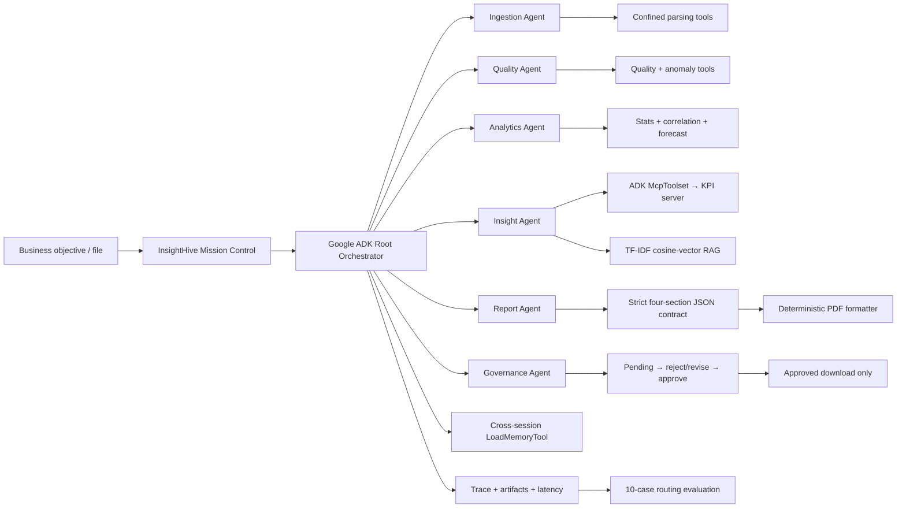

# InsightHive


> **AI agents. Smart insights. Better decisions.**

InsightHive is a governed, observable Google ADK multi-agent system that turns
messy business files into verified analysis, forward-looking risk signals,
MCP-grounded recommendations, and approval-gated executive reports.

**Kaggle track:** Agents for Business  
**Competition:** [AI Agents: Intensive Vibe Coding Capstone Project](https://www.kaggle.com/competitions/vibecoding-agents-capstone-project)  
**Public source:** [github.com/Harshit-jetwani07/InsightHive](https://github.com/Harshit-jetwani07/InsightHive)  
**Submission status:** GitHub-ready; public demo and video links will be added
after their final incognito-access checks.

## The problem

Business teams routinely receive inconsistent CSV and Excel files. Analysts must
clean them, calculate KPIs, investigate anomalies, forecast performance, write
executive summaries, and wait for approval. Conventional dashboards expose
charts but do not coordinate the workflow. Generic chatbots can select the wrong
columns, invent numbers, and publish outputs without review.

InsightHive addresses a problem with revenue and operational risk on the line:
how can one business objective become a traceable, evidence-backed decision
workflow without giving an LLM uncontrolled access to data or publishing?

## Why agents are central

This is not a chatbot wrapped around a dataframe. A root ADK orchestrator owns
the objective, selects specialists and deterministic tools, and continues until
the objective-specific evidence rubric is satisfied.

- **Ingestion Agent** — confined CSV/Excel parsing and schema verification.
- **Quality Agent** — readiness scoring, missing values, duplicates, anomalies.
- **Analytics Agent** — descriptive statistics, correlations, and forecasting.
- **Insight Agent** — business implications, vector RAG, and live MCP retrieval.
- **Report Agent** — contract-validated executive report sections.
- **Governance Agent** — human approval, rejection, revision, and publish gates.
- **Root Orchestrator** — dynamic planning, delegation, synthesis, and memory.

## One-objective experience

In **Agent Mission Control**, a user enters one goal such as:

> Analyze material revenue and return-rate risks, forecast the next twelve
> periods, recommend actions, prepare an executive report, and verify the human
> approval gate.

The UI then exposes:

- specialists and tools selected by the orchestrator;
- structured tool artifacts and latency;
- an objective-specific mission success score;
- MCP, forecast, report, and governance evidence;
- the final executive synthesis.

## Architecture



See [submission/ARCHITECTURE.md](submission/ARCHITECTURE.md) for the governed
runtime flow.

## Course concepts demonstrated

The competition requires at least three; InsightHive visibly demonstrates four
official concepts and several supporting practices:

| Official concept | InsightHive evidence |
| --- | --- |
| Agent / Multi-agent system (ADK) | Root orchestrator, six specialists, dynamic transfers |
| MCP Server | Live `McpToolset` calling the KPI playbook stdio server |
| Security features | Confined uploads, injection guard, secret hygiene, numeric grounding, HITL gate |
| Deployability | Docker Compose, Cloud Run, Cloud Build, reproducible environment |

Additional evidence includes ADK sessions, cross-session memory, deterministic
function tools, vector RAG, observability, evaluation, report contracts, and
human-in-the-loop revision lineage.

## Technical highlights

- Google ADK root agent with six specialist sub-agents.
- Thirteen deterministic tools for ingestion, analysis, retrieval, validation,
  reporting, and governance.
- Live MCP interoperability—not a mocked server or documentation-only claim.
- Auditable TF-IDF cosine-vector retrieval with source and similarity scores.
- Cross-session memory proof: store preference → fresh session → `load_memory`.
- Structured trace events for agent, tool, arguments, response, status, latency.
- Ten natural-language routing cases with one explicit retry and downloadable
  judge-evidence JSON.
- Mission completion is blocked unless objective-specific evidence passes.
- Temperature `0` and pinned `gemini-2.5-flash` for reproducibility and
  quota efficiency.
- Report Agent JSON validation, repair retry, and a hard boundary preventing
  legacy prose generation in ADK report mode.
- Human approval is mandatory before PDF download.
- GitHub Actions compiles, tests, and checks secret/runtime hygiene.

## Reliable demonstration data

**Northstar Retail** is a two-year weekly benchmark containing deliberate but
realistically distributed signals:

- growth and seasonality;
- regional and product targets;
- margin movement;
- an East electronics campaign lift;
- a West electronics supply disruption;
- persistently elevated South apparel returns.

This makes the demo repeatable while still requiring actual analysis. Uploaded
datasets are quality-scored because insight reliability depends on source data.

## Quick start — Full ADK Docker mode

Prerequisites: Docker Desktop with WSL 2 and a Gemini API key.

```powershell
git clone https://github.com/Harshit-jetwani07/InsightHive.git
cd InsightHive
Copy-Item .env.docker.example .env.docker
notepad .env.docker
docker compose up -d --build
```

Open [http://localhost:8501](http://localhost:8501), choose
**Launch judge demo**, load **Northstar Retail Demo**, and open
**Agent Control Room**.

Verify:

```powershell
docker compose ps
docker compose logs -f insight-hive
```

Stop:

```powershell
docker compose down
```

`.env.docker` is ignored by Git. Never place API keys or passwords in source,
screenshots, videos, commits, or Kaggle writeups.

## Native sample mode

Python 3.12 is pinned in `.python-version`.

```powershell
py -3.12 -m venv .venv
.\.venv\Scripts\Activate.ps1
python -m pip install -r requirements.txt
streamlit run app.py
```

Without Gemini, Sample Intelligence Mode keeps deterministic statistics,
quality checks, reports, and contract tests demonstrable. Full competition
evidence should be recorded in Docker ADK mode.

## Evaluation and testing

```powershell
docker compose run --rm insight-hive sh -c "pip install -q pytest && python -m pytest -q"
```

In the app, **Evaluation** measures:

- routing pass rate and first-attempt accuracy;
- selected tools for all ten cases;
- average and total latency;
- MCP runtime evidence;
- governed pipeline evidence;
- HITL publish-gate evidence;
- grounding and usefulness.

Download `adk_evaluation_evidence.json` and attach its headline metrics to the
writeup. Never fabricate a benchmark; record the final deployed run.

## Deployment

- [Docker and Cloud Run instructions](DEPLOYMENT.md)
- [Cloud Build configuration](cloudbuild.yaml)
- [Reproduction and deployment checklist](submission/SUBMISSION_CHECKLIST.md)

A live deployment is optional, but the Kaggle project must provide a public
project link. This public GitHub repository provides full reproduction
instructions; when the Cloud Run demo is attached, **Launch judge demo** must
remain accessible without a login or paywall.

## Security and governance

- No seeded credentials or committed secrets.
- Environment/Streamlit-secret bootstrap only.
- Upload paths are confined and filenames sanitized.
- Prompt-injection patterns are blocked before model execution.
- Numeric claims can be checked against dataset evidence.
- Pending and rejected reports cannot be downloaded.
- Revisions retain parent id and review history.
- The clean-package builder excludes virtual environments, Git internals,
  databases, uploads, reports, exports, secrets, and bytecode.

## Repository map

```text
agents/          ADK root and specialist agents
tools/           deterministic function, MCP/RAG, validation, governance tools
services/        runner, sessions/memory, traces, evaluation, contracts
mcp_server/      live KPI playbook MCP server
rag/             public industry KPI knowledge base
pages/           authentication and administration UI
tests/           14 unit/integration contract tests
evaluation/      deterministic and real-routing cases
submission/      writeup, video script, rubric map, evidence checklist
```

## Submission resources

- [Kaggle-ready writeup](submission/WRITEUP.md)
- [Official-rubric alignment](submission/RUBRIC_ALIGNMENT.md)
- [Five-minute narration and shot list](submission/DEMO_VIDEO_SCRIPT.md)
- [Posting and media checklist](submission/KAGGLE_POSTING_GUIDE.md)
- [Judge evidence sheet](submission/EVIDENCE.md)
- [Evaluation methodology](submission/EVALUATION.md)
- [Security policy](SECURITY.md)
- [Contribution workflow](CONTRIBUTING.md)
- [Kaggle team collaboration guide](submission/TEAM_COLLABORATION.md)
- [Deployment guide](DEPLOYMENT.md)

## Collaboration

InsightHive is prepared for a collaborative Kaggle submission and public GitHub
development. Contributors should use branches, pull requests, CI, and one
review before merging. The final Kaggle roster must credit each teammate's
actual contribution and only one agreed owner should perform the final
submission.

See [CONTRIBUTING.md](CONTRIBUTING.md),
[CODE_OF_CONDUCT.md](CODE_OF_CONDUCT.md), and
[submission/TEAM_COLLABORATION.md](submission/TEAM_COLLABORATION.md).

## License

InsightHive source code and repository documentation are available under the
[MIT License](LICENSE). Third-party platforms, services, and dependencies retain
their respective terms.
