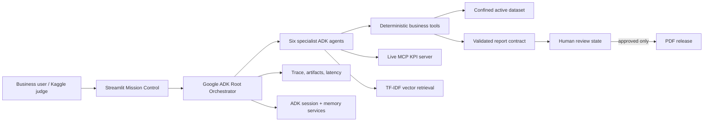
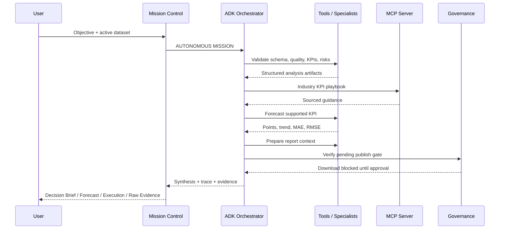
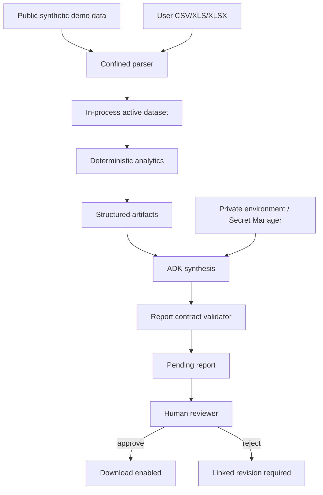
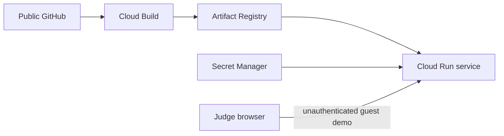

# InsightHive Architecture

**Team:** Harshit Jetwani (Team Leader & Co-Creator) · Jiya Aalwani (Team Member & Co-Creator)

InsightHive is a governed decision-intelligence system built around a Google
ADK root orchestrator. The Streamlit application is the interaction surface;
ADK owns planning and routing; deterministic tools own calculation; humans own
publication authority.


## System context



## Agent fleet

| Agent | Responsibility | Representative evidence |
| --- | --- | --- |
| Root Orchestrator | Owns objective, selects tools/specialists, verifies completion | Mission trace and success rubric |
| Ingestion Agent | Confined CSV/XLS/XLSX parsing and schema verification | `parse_uploaded_dataset`, `get_dataset_overview` |
| Quality Agent | Readiness, missing values, duplicates, anomalies | `evaluate_data_quality`, `detect_anomaly_records` |
| Analytics Agent | Statistics, relationships, time-series forecast | `get_summary_statistics`, `get_correlation_insights`, `run_forecast` |
| Insight Agent | Industry grounding and evidence-based recommendations | Live MCP call and TF-IDF retrieval |
| Report Agent | Executive sections and numeric grounding | Four-section JSON contract |
| Governance Agent | Review, rejection, revision, approval, release | `check_publish_gate`, revision lineage |

## Autonomous mission sequence



The interface does not infer tool execution from prose. It renders function
responses captured from ADK events. Internal `transfer_to_agent` calls remain
traceable but do not inflate the count of business evidence tools.

## Data and trust boundaries



- Filenames are sanitized and file access is confined to the uploads directory.
- Spreadsheet macros are never executed.
- The LLM receives tool outputs; it does not perform authoritative arithmetic.
- Environment values cross into the model client at runtime but never into Git.
- Public guest mode is intended for the synthetic sample, not confidential data.
- Report bytes remain unavailable until the matching review state is approved.

## MCP and retrieval

The Insight Agent creates an ADK `McpToolset` using stdio connection parameters
for `mcp_server/kpi_templates_server.py`. A judge can see
`mcp_get_industry_kpi_playbook` in Agent Trace and the structured artifact in
Mission Control.

The same public KPI documents also support transparent TF-IDF cosine retrieval.
This is a separate local resilience mechanism. InsightHive never labels local
retrieval as a live MCP call.

## Memory

The runner uses ADK session and memory services. The memory proof:

1. stores a preference in one session;
2. commits that session to memory;
3. creates a different session identifier;
4. asks the root agent to call `LoadMemoryTool`;
5. displays the recalled preference and trace evidence.

This demonstrates session-boundary recall rather than reuse of the current chat
history.

## Report and HITL contract

The Report Agent must provide executive summary, findings, recommendations, and
limitations in a strict JSON structure. Invalid output receives a controlled
repair attempt. The deterministic PDF formatter consumes only validated
sections in ADK mode.

Reports have review states:

```text
pending → approved → download allowed
pending → rejected → linked revision → pending → approved
```

The publish gate is enforced in both tool output and UI behavior.

## Observability and evaluation

Each trace contains a trace identifier and events for user query, tool call,
tool response, error, and final response. Tool response events include agent,
tool name, detail, status, and latency.

Evaluation is layered:

1. automated software contracts;
2. deterministic tool execution;
3. ten-case natural-language ADK routing;
4. objective-specific mission completion.

See [EVALUATION.md](EVALUATION.md).

## Failure handling

| Failure | Behavior |
| --- | --- |
| Missing key | Full ADK controls are locked; deterministic capabilities remain available |
| Gemini temporary overload | Provider retry behavior applies; UI does not claim success without evidence |
| Gemini quota exhausted | Clearly labelled local resilience runtime executes deterministic tools and local retrieval |
| Unsupported forecast schema | Objective adapts; no fabricated forecast |
| MCP unavailable | Local retrieval may provide sourced guidance, but is not represented as MCP evidence |
| Invalid report contract | Repair attempt, then deterministic failure rather than legacy prose fallback |
| Pending/rejected report | Download remains blocked |

## Deployment topology

The verified local path is Docker Desktop with the WSL 2 Linux backend. The same
Python 3.12 image can run on Cloud Run:



The public deployment is ephemeral by design. A production evolution would use
Cloud SQL, Cloud Storage, persistent ADK session/memory services, authenticated
enterprise access, and formal audit retention.
